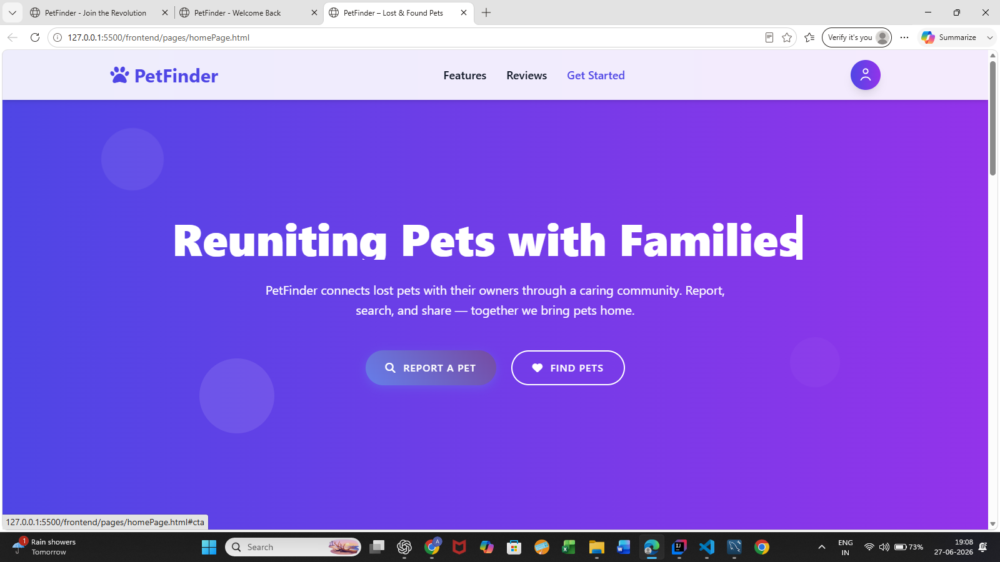
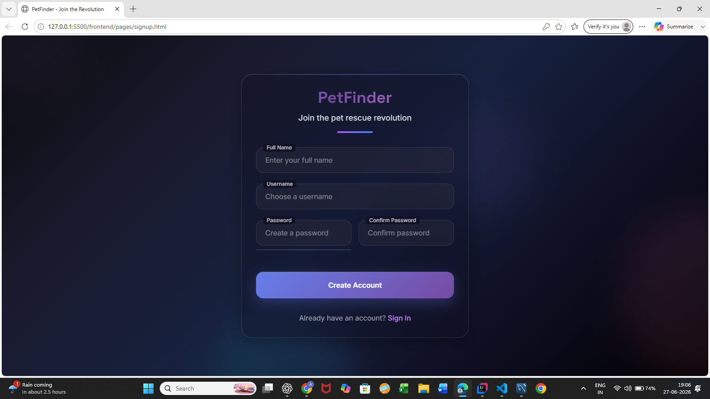
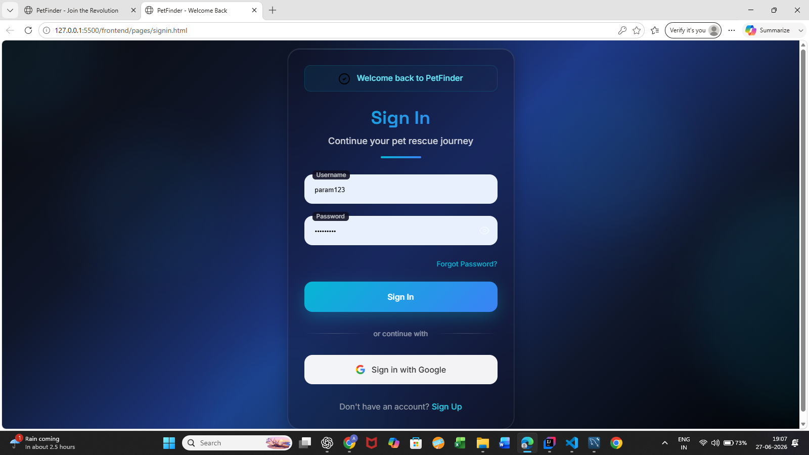
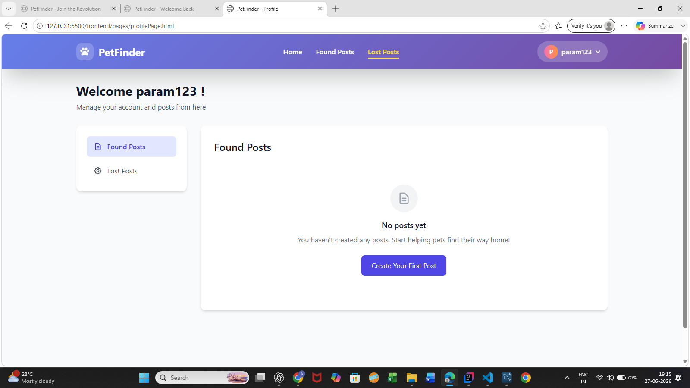
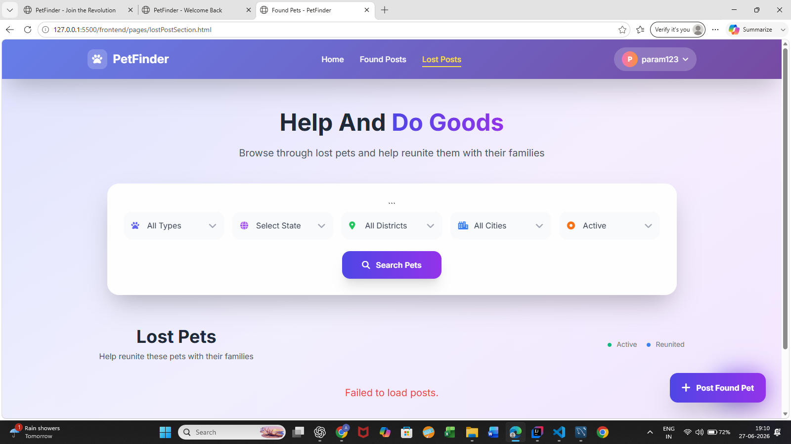
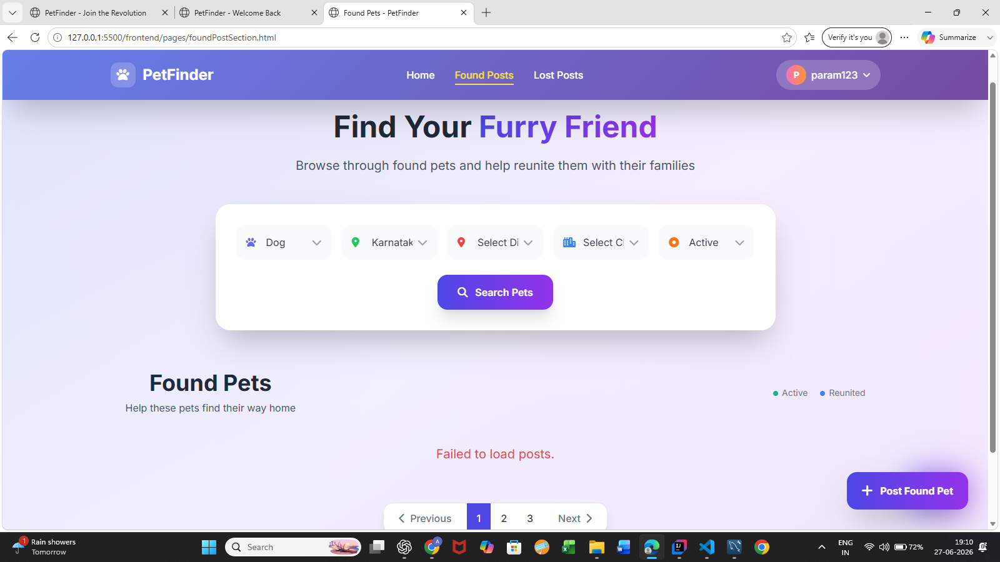
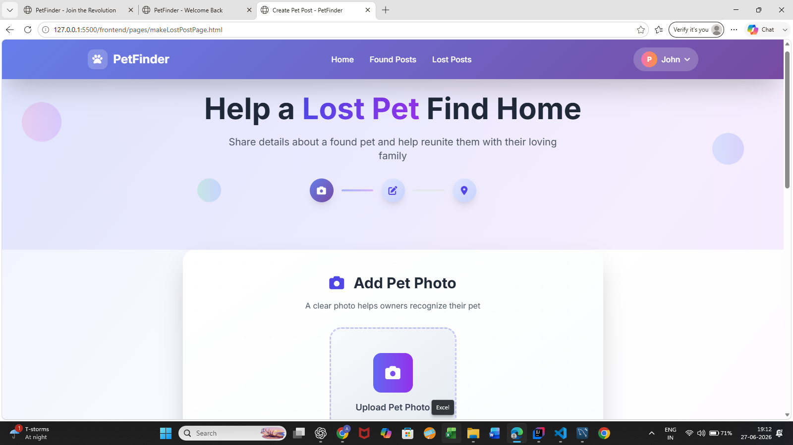
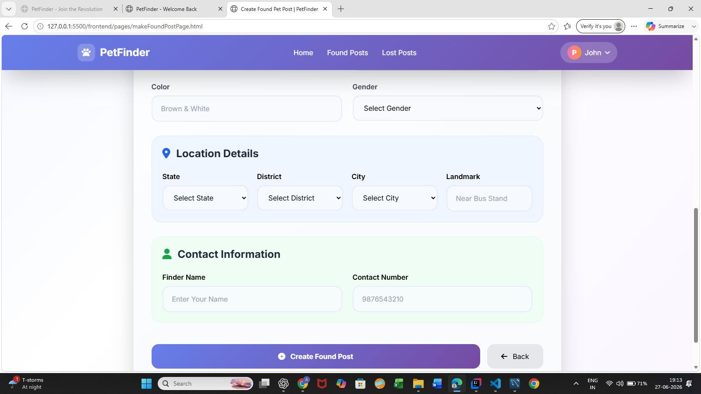

<h1 align="center">🐾 PetFinder</h1>

<p align="center">
A full-stack web application that helps reunite lost pets with their owners through a secure, community-driven platform.
</p>

<p align="center">
Built with <strong>Java • Spring Boot • MySQL • HTML • CSS • JavaScript • JWT Authentication</strong>
</p>

---

# 📖 Overview

PetFinder is a full-stack web application designed to help pet owners and community members work together to reunite lost pets with their families.

Users can report missing pets, publish found pet reports, browse listings, and securely communicate through an authenticated platform. The project emphasizes clean architecture, responsive design, secure authentication, and scalable backend development using Spring Boot.

---

# ✨ Features

### 🔐 Authentication
- User Registration
- Secure Login
- JWT Authentication
- Protected API Routes

### 🐶 Lost Pet Management
- Report Lost Pets
- Upload Pet Photos
- Add Pet Details
- Specify Last Seen Location
- View Lost Pet Listings

### 🐱 Found Pet Management
- Report Found Pets
- Upload Images
- Add Discovery Details
- View Found Pet Listings

### 🔍 Search & Discovery
- Browse Lost Pets
- Browse Found Pets
- Search Listings
- Filter by Location

### 🎨 User Experience
- Responsive Design
- Clean Modern Interface
- Mobile-Friendly Layout
- Easy Navigation

---

# 🛠 Tech Stack

| Technology | Purpose |
|------------|----------|
| Java 17 | Backend Development |
| Spring Boot | REST API Development |
| Spring Security | Authentication & Security |
| JWT | User Authorization |
| MySQL | Database |
| HTML5 | Frontend Structure |
| CSS3 | Styling |
| JavaScript | Client-side Functionality |
| Maven | Dependency Management |
| Git & GitHub | Version Control |

---


# 🏗 Project Architecture

```text
                 Client (HTML/CSS/JavaScript)
                           │
                           ▼
                    Spring Boot REST API
                           │
         ┌─────────────────┼─────────────────┐
         ▼                 ▼                 ▼
 Authentication      Lost Pet Module    Found Pet Module
                           │
                           ▼
                     Service Layer
                           │
                           ▼
               Repository Layer (JPA)
                           │
                           ▼
                     MySQL Database
```


---

## 📁 Project Structure

```text
PetFinder/
│
├── backend/
├── frontend/
├── screenshots/
│   ├── home_page.png
│   ├── signup_page.png
│   ├── signin_page.png
│   ├── profile_page.png
│   ├── lost_page.png
│   ├── found_page.png
│   ├── lostPetCreate_page.png
│   └── foundPetCreate_page.png
│
├── README.md
└── .gitignore
```


---

# 🗄 Database

The application uses **MySQL** to store application data.

Main entities include:

- Users
- Lost Pets
- Found Pets
- Pet Images
- Locations

---

# 🌐 REST API

### Authentication

```

POST   /api/auth/register
POST   /api/auth/login

```

### Lost Pets

```

GET    /api/lost-pets
POST   /api/lost-pets
GET    /api/lost-pets/{id}
PUT    /api/lost-pets/{id}
DELETE /api/lost-pets/{id}

```

### Found Pets

```

GET    /api/found-pets
POST   /api/found-pets
GET    /api/found-pets/{id}
PUT    /api/found-pets/{id}
DELETE /api/found-pets/{id}

```

---

# 📸 Application Screenshots

The following screenshots showcase the key features and user interface of the PetFinder application.

## 🏠 Home Page



---

## 📝 Sign Up



---

## 🔐 Sign In



---

## 👤 User Profile



---

## 🐶 Lost Pet Posts



---

## 🐱 Found Pet Posts



---

## ➕ Create Lost Pet Post



---

## ➕ Create Found Pet Post


```


# ⚙ Installation

## Prerequisites

- Java 17+
- Maven
- MySQL Server
- Git

---

## Clone Repository

```bash
git clone https://github.com/akashnelwade/PetFinder.git
````

```bash
cd PetFinder
```

---

## Configure Database

Create a MySQL database.

```
petfinder
```

Update:

```
application.properties
```

```properties
spring.datasource.url=jdbc:mysql://localhost:3306/petfinder
spring.datasource.username=YOUR_USERNAME
spring.datasource.password=YOUR_PASSWORD
```

---

## Run Backend

```bash
mvn spring-boot:run
```

Backend URL

```
http://localhost:8080
```

---

## Run Frontend

Open the frontend in your browser or use a local server.

Example:

```bash
npx http-server Client
```

---

# 🔒 Authentication

The application uses JWT Authentication.

Workflow:

1. Register
2. Login
3. Receive JWT Token
4. Access Protected APIs

---

# 🎥 Project Demo

Watch the complete project demonstration below.

**YouTube**


---

# 🚀 Future Enhancements

* Google Maps Integration
* Email Notifications
* AI-Based Pet Matching
* Chat Between Owner & Finder
* Admin Dashboard
* Docker Support
* Cloud Deployment
* Progressive Web App (PWA)

---

# 🤝 Contributing

Contributions are welcome.

1. Fork the repository
2. Create a feature branch

```bash
git checkout -b feature/new-feature
```

3. Commit changes

```bash
git commit -m "Add new feature"
```

4. Push changes

```bash
git push origin feature/new-feature
```

5. Open a Pull Request

---

# 📄 License

This project is licensed under the MIT License.

See the **LICENSE** file for more information.

---

# 👨‍💻 Developer

**Akash**

Java Full Stack Developer

GitHub:
https://github.com//akashnelwade/

LinkedIn: [Akash Nelwade](https://www.linkedin.com/in/nelwade-akash/)


Email:[akashneleade3630@gmail.com](mailto:your-ema)

---

# ⭐ Support

If you found this project useful, consider giving it a ⭐ on GitHub.

It helps others discover the project and supports future development.

---

<p align="center">
Made with ❤️ using Java, Spring Boot and MySQL
</p>

